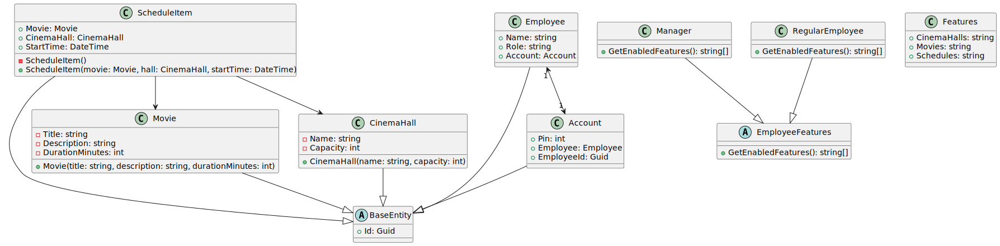

# cinema-manager

## How application looks like
### Login page

### Regular employee view

### Manager view

## Getting started

To run entire solution:

1. Go to api folder and run `docker compose up` - it will create container with PostgreSQL db (empty)
2. In new console window go to api folder and run `dotnet restore` to install .NET dependencies
3. Then in the same directory run `dotnet ef database update` to create necessary tables
4. In the same directory run `dotnet run`
5. Go to the frontend directory and run `npm install`
6. Still in the frontend directory run `npm run dev`

Enjoy your time with this awesome app!!!

## Cinema Management System Overview

The Cinema Management System is an application designed to help manage a cinema. It allows administrators to define cinema halls, add movies, and create schedules (repertoires). The system improves organization and helps automate cinema operations.

### Object-Oriented Programming Principles Implementation

#### Inheritance
- Account class inherits from BaseEntity, gaining its properties (likely an ID)
- Employee and Manager classes inherit from a common Person base class

#### Encapsulation
- Account class encapsulates PIN and employee relationship data with properties
- Service classes (like AccountsService, MovieService) encapsulate database operations and business logic
- Data access is controlled through getters/setters rather than direct field access

#### Abstraction
- Service layer provides abstraction by hiding implementation details of operations
- The relationship between Account and Employee abstracts authentication from user identity
- EmployeeFeaturesService abstracts role-based capabilities

#### Polymorphism
- Different employee types (Manager, Regular Employee) implement the getRole() method according to their specific needs
- Authentication and authorization mechanisms use polymorphic behavior to handle different account types

### Description

The Cinema Management System allows administrators to define cinema halls, add movies, and create schedules. Each hall can have different seating configurations. Movies include basic information such as title, duration, and genre. The schedule feature lets users assign movies to specific halls and time slots, making it easy to plan screenings.

### Additional System Features
- **Employee Management**: Different types of employees (regular employees and managers) with specific roles and permissions
- **Authentication System**: Secure PIN-based login system with JWT token issuance
- **Account Management**: Creation and management of employee accounts with associated credentials
- **Role-Based Access Control**: Different features are accessible based on employee roles

### Architecture Design Principles
- **Service Layer**: Dedicated services handle specific domain operations
- **Repository Pattern**: Services encapsulate data access and manipulation operations

## Implemented Features

- System-wide description and documentation
- Ability to add cinema rooms
- Ability to add movies
- Schedule creation based on rooms and available movies
- Responsive UI (RWD)
- PIN-based login

## Technologies

- C# .NET
- Entity Framework
- PostgreSQL
- JWT
- JavaScript
- React
- Tailwind
- Redux + RTK Query

## Notes

- PIN login will be simplified for MVP and hardcoded in the codebase

## Problems description

- At first we used in cache memory db, but due to problems with data loosing we decide to switch to postgressql. Switch was very easy, we change provider in config file and add docker-compose for db. We choose docker composer because it is easier to setup local environment.
